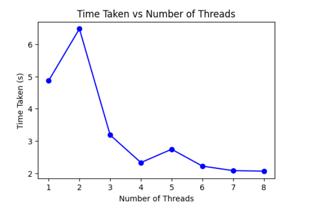

# Matrix Multiplication Performance Benchmark
## Submitted By:

- **Name:** Alok Shree Koirala 
- **Roll Number:** 102103157 
- **Group:** 3CO6

## Graphs

1. **Thread vs Time Taken**: A line plot illustrating the relationship between the number of threads and the execution time of matrix multiplication operations. This visualization highlights how multi-threading affects computation speed and efficiency.

3. **CPU Usage vs Threads**: A line plot depicting CPU utilization over the course of matrix multiplication experiments. This visualization provides insights into how effectively CPU cores are utilized during multi-threaded computation tasks.

5. **Cores Utilization**: A line plot showing CPU utilization over the course of matrix multiplication experiments. This visualization provides insights into how effectively CPU cores are utilized during multi-threaded computation tasks.

 

